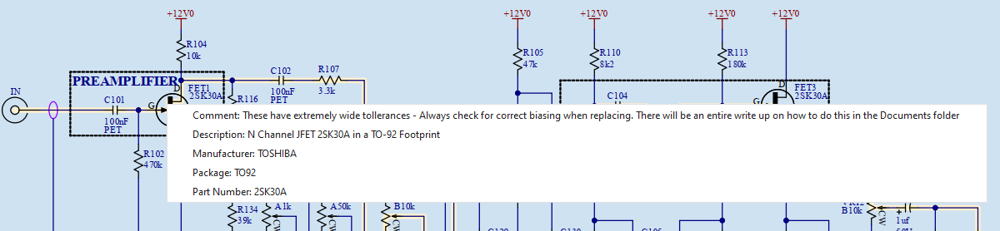
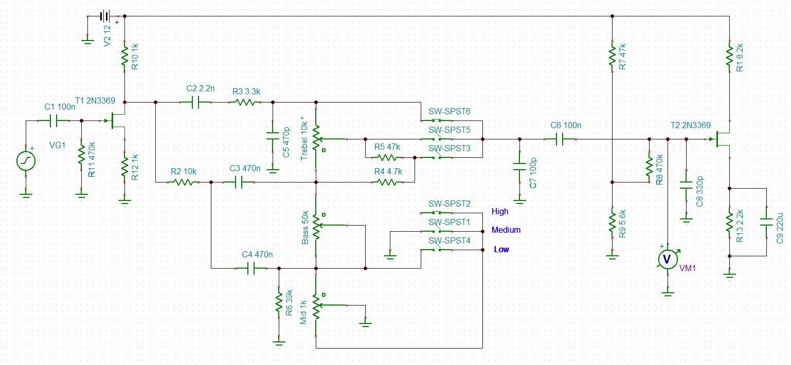

# Yamaha Electric Grand (CP-70 and CP-80) Preamp Work

This all started out as a "simple" CP-80 restoration and (as usual) turned into a year long project... And still continues. Once I started really digging into things, I realized I needed to document my work both in words and video. Initially this documentation was simply so I remembered what I was doing but eventually, I realized there were others out there struggling with the same issues I had been running into. These issues are primarily spare parts, readable schematics, and in depth repair knowledge. To that end, I decided to put my work up here on github so that others could not only benefit from what I have done, but also point out any mistakes I may be making as well as contribute their own knowledge.

What you see up here currently (as of November 2025) are a collection of files, specs, and simulations I have put together and am trying to get organized into something cohesive. Below I will delineate each section and what is in it. As always, please feel free to comment, ask questions, and/or add your own experiences.

This is still an ongoing endeavor and there is much I want to do. I am always open to suggestions.

## Altium Files

I use Altium in me every day life as my primary tool for designing electronic schematics and PCBs but I do understand that not everyone has access to this tool. If you do have access to Altium, you will find the entire schematic and part libraries in the **Altium Files** folder. On the other hand, if you do not have access to Altium, do not despair as you will find what is known as a Smart PDF of the schematic in the **Documents** folder named "Schematic - CP80 Preamp - SmartPDF."

## SmartPDF Schematic

The smartPDF schematic, named "Schematic - CP80 Preamp - SmartPDF", is a very useful document. In it you will find the preamp schematic which I have redrawn and find much more readable. But wait, there's more! By clicking on any part in the schematic, you will get a pop-up which includes the original part number, manufacturer, part description, and a comment field where I have listed what I suggest to use if you want or need to replace that particular part. Some parts have a lot of information while others do not require so much. Below is an example showing what appears when FET1 is clicked:

Additionally on the schematic, you will see my notes and highlights. The following is from the bottom of the PDF and explains a bit of the information it contains:

*The MCD-527 LDRs (Light Dependent Resistors):*
*TRD101 and TRD102, are split into 2 parts each. These parts are the LED light source (Part B - Highlighted Green) and the Photoresistor (Part A - Highlighted Red).* 

*Signal Flow:*
*Audio enters from the piezo pickups at the upper left and is highlighted in yellow all the way to the buffer amplifiers where it is split into unvbalanced  high and balanced low impeadance stereo signals. The left high impeadance signal is highlighted in red while the right high impeadance signal is highlighted in green. The left low impeadance signal is highlighted in purple while the right low impeadance signal is highlighted in pink.*

*The tone brilliance signals are detailed on the far right, external controls are labeled in bold red, and adjustment pots are highlighted in bright green boxes.*

*Clicking on any component in the PDF file will show the original part number, part specifications, and notes on replacement parts.*

*Using the PDF file bookmarks, you can jump to any specific part or net.*

## Part Data Sheets

This is pretty self explanatory. In the Part Data Sheets folder you will find data sheets for some of the parts in the preamp. Most of these are simply data sheets that are hard to find, so I included them here as an easy reference. Additionally, when I am researching acceptable alternatives, I put those data sheets in there as well. I may add more over time.

## TINA-TI Spice Files

For those that are not familiar with TINA-TI, it is a free, SPICE-based circuit simulation software from Texas Instruments (TI) and DesignSoft that is used to design, test, and analyze analog, digital, and mixed electronic circuits. It includes a graphical interface for schematic capture, analysis capabilities like DC, transient, and frequency domain, and virtual instruments. The program is a simplified version of the full TINA Design Suite but remains powerful enough for complex circuits.  For more information check out TINA-TI's website: [https://www.ti.com/tool/TINA-TI](https://www.ti.com/tool/TINA-TI).

The main files TINA uses have a TSC extension and the graphing files have a tdr extension. Below you can see the schematic which I have entered into TINA (CP-80.TSC):

There is a document in the Documents folder (and eventually a video link) "CP-80 Preamp TINA-TI Simulations" that explains the circuit and how to generate simulations like the one below (this one shows the frequency response from 1hZ to 20kHz with the Brilliance Switch set to High, Bass and Treble controls at 99%, and the Mid control set to 10 different settings as shown in the legend of the plot):

